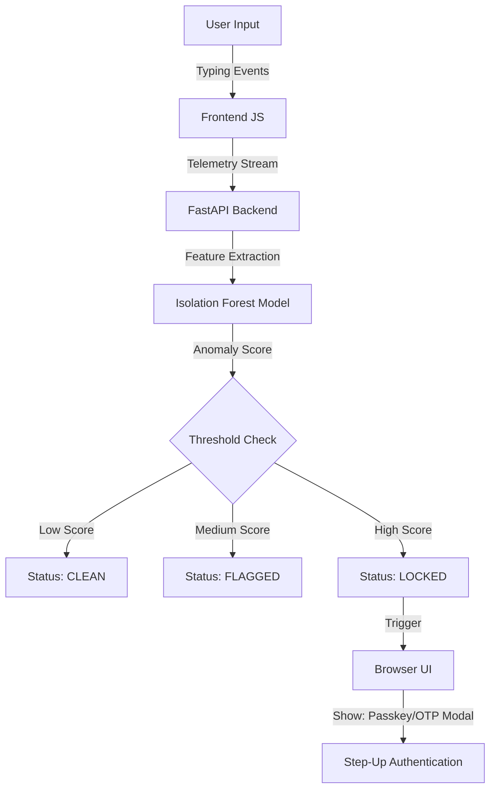

# Real-time ML-Powered Behavioral Biometrics Engine

**A production-grade behavioral biometrics engine that stops bots and AI mimics in real-time.** This system analyzes typing dynamics (dwell time, flight time, rhythm) to differentiate human users from automated scripts and LLM-generated text, locking accounts the moment anomalous behavior is detected.

## Key Features

- **Real-time Behavioral Analysis:** Uses **Isolation Forest**, the industry-standard algorithm for anomaly detection, to score user behavior on every keystroke.
- **Hybrid Detection:** Detects both **bots** (via typing pattern anomalies) and **AI Mimics** (via large language models evaluating typing rhythm and velocity).
- **Instant Account Locking:** Automatically locks accounts and triggers step-up authentication (Passkey or OTP) when anomalies exceed a strict confidence threshold.
- **Interactive Demo:** A live, working proof-of-concept showing the engine in action with visual feedback and a "Fight the Bot" mode.

## Architecture

### Backend: Real-time Machine Learning (Python FastAPI)

Our FastAPI backend is the decision-making brain. It uses **Isolation Forest** to detect typing anomalies with sub-second latency.

**Key Components:**

- **Model**: `IsolationForest` (n_estimators=100, contamination=0.1)
- **Features**: Average dwell time, flight time, and inter-key intervals.
- **Detection Pipeline**:
  1. **Data Ingestion**: Accepts `(keydown, keyup)` events via a streaming-optimized API.
  2. **Feature Extraction**: Calculates typing metrics on the fly.
  3. **Inference**: Scores each event against the trained model.
  4. **Action**: Returns `CLEAN`, `FLAGGED`, or `LOCKED` status.
- **AI Mimic Detection (Upcoming)**: Integrated Large Language Model (LLM) pipeline that scores text patterns for artificiality.

### Frontend: Visual Biometric Dashboard (Next.js)

A dynamic dashboard that provides immediate visual feedback on the security state:

- **Security Banner**: Glows green (Safe), amber (Suspicious), or red (Locked) based on the engine's response.
- **Live Typing Feed**: Visualizes dwell time and flight time for every keypress.
- **Interactive Demo**:
  - **Human Mode**: Normal typing patterns are accepted.
  - **Bot Mode**: Demonstrates how AI-generated text triggers the engine to lock the account.
  - **Verification**: Challenge-response system (Passkey/OTP) to regain access.

## Getting Started

### Prerequisites

- **Node.js** 18+ (for Frontend)
- **Python** 3.11+ (for Backend)
- **npm** or **yarn**

### Installation

#### 1. Backend Setup
```bash
cd backend
pip install -r requirements.txt

# Start the server
uvicorn main:app --reload
```
The backend will be available at `http://localhost:8000`.

#### 2. Frontend Setup
```bash
cd frontend
npm install

# Start the development server
npm run dev
```
The frontend will be available at `http://localhost:3000`.

## Usage

### Testing the Engine

1. Open **http://localhost:3000** in your browser.
2. Observe the **Security Banner** at the top.
3. Type normally into the login fields. You should see a green glow (CLEAN).
4. Click **"Fight the Bot"** in the sidebar to enter Bot Mode.
5. The engine will now look for anomalies. Because AI-generated text often has unnatural typing rhythms, the system will quickly detect it and **lock the account**.
6. You will be prompted to verify with a Passkey or OTP to regain access.

## Technology Stack

| Layer | Technology | Purpose |
|-------|------------|---------|
| **Backend** | Python, FastAPI, Isolation Forest, NumPy | Real-time anomaly detection engine |
| **Frontend** | Next.js, React, Tailwind CSS, Shadcn/UI | Dynamic dashboard with visual feedback |
| **State Management** | Global Security Context | React Context API for real-time state synchronization |

## Security Architecture



## Local Model Training & Evaluation

You can retrain the isolation forest model on your own data using the `scripts/train_model.py` script.

**Usage:**
```bash
python scripts/train_model.py --dataset path/to/your/data.csv
```

This script will:
1. Train the `IsolationForest` on your provided data.
2. Generate a `model.pkl` file in the `data/` directory.
3. Evaluate the model's accuracy and generate a performance report.

## License

MIT License
